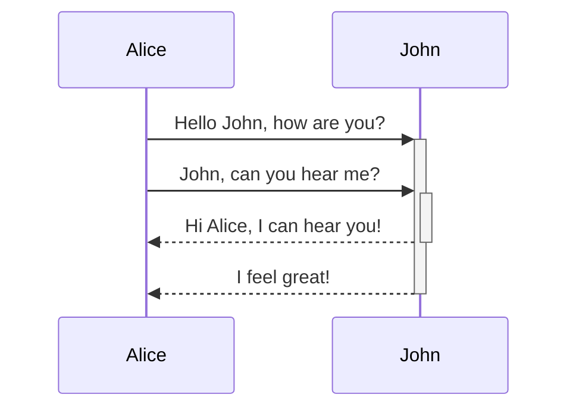
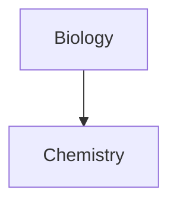

This page covers advanced formatting elements that go beyond basic Markdown. For the foundational syntax, see [Basic formatting](/editing/basic-formatting).

## Tables

Create tables using vertical bars (`|`) to separate columns and hyphens (`-`) to define the header row:

```md
| First name | Last name |
| ---------- | --------- |
| Max        | Planck    |
| Marie      | Curie     |
```

The vertical bars on either side of the table are optional, but including them improves readability. Cells don't need to be perfectly aligned, but the header row must contain at least two hyphens per column:

```md
First name | Last name
-- | --
Max | Planck
Marie | Curie
```

<Tip>
In Live Preview, right-click a table to add or delete columns and rows, or to sort and move them using the context menu. You can also insert a table using the **Insert Table** command from the Command Palette.
</Tip>

### Aligning table columns

Align column content by adding colons (`:`) to the header row separator:

```md
Left-aligned text | Center-aligned text | Right-aligned text
:-- | :--: | --:
Content | Content | Content
```

### Formatting content within a table

You can use basic Markdown formatting (bold, italic, inline code) inside table cells. To use a vertical bar `|` inside a cell — for example in an alias or image resize — escape it with a backslash:

```md
First column | Second column
-- | --
[[Basic formatting syntax\|Markdown syntax]] | ![[image.jpg\|200]]
```

## Math

Obsidian supports math expressions using [MathJax](http://docs.mathjax.org/en/latest/basic/mathjax.html) and LaTeX notation.

### Block math

Surround the expression with double dollar signs (`$$`) to display it as a block:

```md
$$
\begin{vmatrix}a & b\\
c & d
\end{vmatrix}=ad-bc
$$
```

### Inline math

Wrap the expression in single `$` symbols to display it inline within a sentence:

```md
This is an inline math expression $e^{2i\pi} = 1$.
```

For a syntax reference, see the [MathJax basic tutorial and quick reference](https://math.meta.stackexchange.com/questions/5020/mathjax-basic-tutorial-and-quick-reference). For supported packages, see [The TeX/LaTeX Extension List](http://docs.mathjax.org/en/latest/input/tex/extensions/index.html).

## Mermaid diagrams

Obsidian supports [Mermaid](https://mermaid-js.github.io/) for creating diagrams and charts, including flow charts, sequence diagrams, and timelines.

Create a diagram by opening a `mermaid` code block:

````md

````

````md

````

<Tip>
Use [Mermaid's Live Editor](https://mermaid-js.github.io/mermaid-live-editor) to build and preview diagrams before adding them to your notes.
</Tip>

### Linking notes from a diagram

You can create internal links inside a diagram by attaching the `internal-link` class to nodes:

````md

````

For diagrams with many nodes, assign the class to a predefined list of node letters:

````md

````

Each letter node becomes an internal link, with the node text as the link label.

<Note>
If a note name contains special characters, wrap it in double quotes: `class "⨳ special character" internal-link`. Internal links from diagrams do not show up in Graph view.
</Note>

For full diagram syntax, refer to the [official Mermaid docs](https://mermaid.js.org/intro/).
